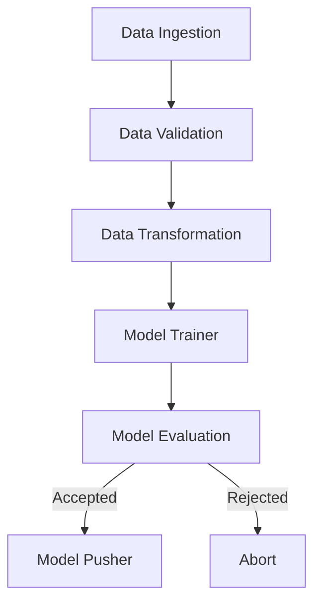

# US Visa Approval Prediction - MLOps Production-Ready Project Summary

This project implements a production-ready Machine Learning Operations (MLOps) pipeline designed to predict **US Visa approval case status** (`case_status`: Certified (0) or Denied (1)) based on various applicant and company features.

It follows a highly modular design pattern that separates constants, configuration, entity definitions, pipeline stages (components), data access layers, and cloud integrations. It includes drift detection, automatic hyperparameter search, AWS S3 model registry integration, Docker containerization, and automated GitHub Actions CI/CD workflows for EC2 deployment.

---

## 📂 Project Structure & Directory Layout

Below is the layout of the project, including descriptions of all critical directories and files:

*   **`config/`**
    *   [`schema.yaml`](file:///c:/Users/HP/OneDrive/Desktop/MLOPs-Production-Ready-Machine-Learning-Project/config/schema.yaml): Defines column schema, datatypes (numerical, categorical), columns to drop, ordinal and one-hot encoding feature lists, and columns requiring transformation.
    *   [`model.yaml`](file:///c:/Users/HP/OneDrive/Desktop/MLOPs-Production-Ready-Machine-Learning-Project/config/model.yaml): Configures hyperparameters for model training using `GridSearchCV` (e.g., `KNeighborsClassifier` and `RandomForestClassifier`).
*   **`flowcharts/`**
    *   Contains visualization diagrams showing step-by-step logic for [Data Ingestion](file:///c:/Users/HP/OneDrive/Desktop/MLOPs-Production-Ready-Machine-Learning-Project/flowcharts/Data%20Ingestion.png), [Data Validation](file:///c:/Users/HP/OneDrive/Desktop/MLOPs-Production-Ready-Machine-Learning-Project/flowcharts/Data%20Validation.png), [Data Transformation](file:///c:/Users/HP/OneDrive/Desktop/MLOPs-Production-Ready-Machine-Learning-Project/flowcharts/Data%20Transformation.png), [Model Trainer](file:///c:/Users/HP/OneDrive/Desktop/MLOPs-Production-Ready-Machine-Learning-Project/flowcharts/Model%20Trainer.png), [Model Evaluation](file:///c:/Users/HP/OneDrive/Desktop/MLOPs-Production-Ready-Machine-Learning-Project/flowcharts/Model%20Evaluation.png), [Model Pusher](file:///c:/Users/HP/OneDrive/Desktop/MLOPs-Production-Ready-Machine-Learning-Project/flowcharts/Model%20Pusher.png), and the overall [Folder Structure](file:///c:/Users/HP/OneDrive/Desktop/MLOPs-Production-Ready-Machine-Learning-Project/flowcharts/folder%20structure.png).
*   **`notebook/`**
    *   [`1_EDA_US_visa.ipynb`](file:///c:/Users/HP/OneDrive/Desktop/MLOPs-Production-Ready-Machine-Learning-Project/notebook/1_EDA_US_visa.ipynb): Exploratory Data Analysis.
    *   [`2_Feature_Engineering_and_Model_Training.ipynb`](file:///c:/Users/HP/OneDrive/Desktop/MLOPs-Production-Ready-Machine-Learning-Project/notebook/2_Feature_Engineering_and_Model_Training.ipynb): Offline feature engineering experiments and model benchmarking.
    *   [`data_drift_demo_evidently.ipynb`](file:///c:/Users/HP/OneDrive/Desktop/MLOPs-Production-Ready-Machine-Learning-Project/notebook/data_drift_demo_evidently.ipynb): Sandbox testing of dataset drift using Evidently AI.
    *   [`mongodb_demo.ipynb`](file:///c:/Users/HP/OneDrive/Desktop/MLOPs-Production-Ready-Machine-Learning-Project/notebook/mongodb_demo.ipynb): Experimentation with MongoDB database connection.
*   **`us_visa/`** (Core source package)
    *   [`constants`](file:///c:/Users/HP/OneDrive/Desktop/MLOPs-Production-Ready-Machine-Learning-Project/us_visa/constants/__init__.py): Holds constant definitions like database names, artifact keys, file paths, AWS parameters, hyperparameter paths, and host details.
    *   [`configuration`](file:///c:/Users/HP/OneDrive/Desktop/MLOPs-Production-Ready-Machine-Learning-Project/us_visa/configuration): Connections for databases and external resources. Includes [aws_connection.py](file:///c:/Users/HP/OneDrive/Desktop/MLOPs-Production-Ready-Machine-Learning-Project/us_visa/configuration/aws_connection.py) (S3 clients) and [mongo_db_connection.py](file:///c:/Users/HP/OneDrive/Desktop/MLOPs-Production-Ready-Machine-Learning-Project/us_visa/configuration/mongo_db_connection.py) (MongoDB client).
    *   [`entity`](file:///c:/Users/HP/OneDrive/Desktop/MLOPs-Production-Ready-Machine-Learning-Project/us_visa/entity):
        *   [`config_entity.py`](file:///c:/Users/HP/OneDrive/Desktop/MLOPs-Production-Ready-Machine-Learning-Project/us_visa/entity/config_entity.py): Configurations dataclasses for every pipeline step.
        *   [`artifact_entity.py`](file:///c:/Users/HP/OneDrive/Desktop/MLOPs-Production-Ready-Machine-Learning-Project/us_visa/entity/artifact_entity.py): Dataclasses representing output artifacts of pipeline steps.
        *   [`estimator.py`](file:///c:/Users/HP/OneDrive/Desktop/MLOPs-Production-Ready-Machine-Learning-Project/us_visa/entity/estimator.py): Contains prediction model wraps (`USvisaModel`) and label maps (`TargetValueMapping`).
        *   [`s3_estimator.py`](file:///c:/Users/HP/OneDrive/Desktop/MLOPs-Production-Ready-Machine-Learning-Project/us_visa/entity/s3_estimator.py): Encapsulates AWS S3 model loading, saving, and inference.
    *   [`components`](file:///c:/Users/HP/OneDrive/Desktop/MLOPs-Production-Ready-Machine-Learning-Project/us_visa/components): Core ML stage executables. Includes [data_ingestion.py](file:///c:/Users/HP/OneDrive/Desktop/MLOPs-Production-Ready-Machine-Learning-Project/us_visa/components/data_ingestion.py), [data_validation.py](file:///c:/Users/HP/OneDrive/Desktop/MLOPs-Production-Ready-Machine-Learning-Project/us_visa/components/data_validation.py), [data_transformation.py](file:///c:/Users/HP/OneDrive/Desktop/MLOPs-Production-Ready-Machine-Learning-Project/us_visa/components/data_transformation.py), [model_trainer.py](file:///c:/Users/HP/OneDrive/Desktop/MLOPs-Production-Ready-Machine-Learning-Project/us_visa/components/model_trainer.py), [model_evaluation.py](file:///c:/Users/HP/OneDrive/Desktop/MLOPs-Production-Ready-Machine-Learning-Project/us_visa/components/model_evaluation.py), and [model_pusher.py](file:///c:/Users/HP/OneDrive/Desktop/MLOPs-Production-Ready-Machine-Learning-Project/us_visa/components/model_pusher.py).
    *   [`data_access`](file:///c:/Users/HP/OneDrive/Desktop/MLOPs-Production-Ready-Machine-Learning-Project/us_visa/data_access/usvisa_data.py): Reads and exports collections from MongoDB as pandas DataFrames.
    *   [`pipline`](file:///c:/Users/HP/OneDrive/Desktop/MLOPs-Production-Ready-Machine-Learning-Project/us_visa/pipline): Coordinates orchestrations. Includes [training_pipeline.py](file:///c:/Users/HP/OneDrive/Desktop/MLOPs-Production-Ready-Machine-Learning-Project/us_visa/pipline/training_pipeline.py) (manages training flow) and [prediction_pipeline.py](file:///c:/Users/HP/OneDrive/Desktop/MLOPs-Production-Ready-Machine-Learning-Project/us_visa/pipline/prediction_pipeline.py) (supports web request predictions).
    *   [`utils`](file:///c:/Users/HP/OneDrive/Desktop/MLOPs-Production-Ready-Machine-Learning-Project/us_visa/utils/main_utils.py): Common utils like file/YAML loaders, numpy arrays, and object serialization tools.
    *   [`logger`](file:///c:/Users/HP/OneDrive/Desktop/MLOPs-Production-Ready-Machine-Learning-Project/us_visa/logger/__init__.py) & [`exception`](file:///c:/Users/HP/OneDrive/Desktop/MLOPs-Production-Ready-Machine-Learning-Project/us_visa/exception/__init__.py): Centralized logging and custom exception tracking.
*   **`app.py`**: A FastAPI application serving web pages (`templates/usvisa.html`) to predict new applications interactively, along with a `/train` trigger route.
*   **`setup.py`**: Packages the codebase as a local installable package.
*   **`Dockerfile`**: Containerizes the FastAPI deployment.
*   **`.github/workflows/aws.yaml`**: Coordinates Github Actions CI/CD to AWS ECR and EC2.

---

## ⚙️ Detailed Pipeline Stages

The Training Pipeline consists of six stages:

### 1. Data Ingestion
*   **Module**: [`data_ingestion.py`](file:///c:/Users/HP/OneDrive/Desktop/MLOPs-Production-Ready-Machine-Learning-Project/us_visa/components/data_ingestion.py)
*   **Functionality**: 
    1. Connects to MongoDB database using variables defined in environment (`MONGODB_URL`).
    2. Exports the raw dataset `US_VISA.visa_data` to a local csv feature store under the `artifact` directory.
    3. Performs train-test splitting (configured ratio of `0.2`) and exports `train.csv` and `test.csv`.

### 2. Data Validation
*   **Module**: [`data_validation.py`](file:///c:/Users/HP/OneDrive/Desktop/MLOPs-Production-Ready-Machine-Learning-Project/us_visa/components/data_validation.py)
*   **Functionality**:
    1. Validates the incoming columns count and names against [`schema.yaml`](file:///c:/Users/HP/OneDrive/Desktop/MLOPs-Production-Ready-Machine-Learning-Project/config/schema.yaml).
    2. Evaluates dataset drift between train and test splits using **Evidently AI** (`DataDriftProfileSection`).
    3. Generates a data drift validation report in YAML format. If drift is detected, it throws warning indicators.

### 3. Data Transformation
*   **Module**: [`data_transformation.py`](file:///c:/Users/HP/OneDrive/Desktop/MLOPs-Production-Ready-Machine-Learning-Project/us_visa/components/data_transformation.py)
*   **Functionality**:
    1. Performs feature engineering by generating `company_age = CURRENT_YEAR - yr_of_estab` and dropping `case_id` and `yr_of_estab`.
    2. Constructs a standard preprocessor pipeline using `ColumnTransformer`:
        *   **`OneHotEncoder`** for nominal columns (`continent`, `unit_of_wage`, `region_of_employment`).
        *   **`OrdinalEncoder`** for ordered categories (`education_of_employee`, `has_job_experience`, `requires_job_training`, `full_time_position`).
        *   **`PowerTransformer`** (using Yeo-Johnson method) to handle numerical distributions.
        *   **`StandardScaler`** to scale numeric fields.
    3. Applies **SMOTEENN** (Synthetic Minority Over-sampling Technique + Edited Nearest Neighbors) to mitigate target class imbalance.
    4. Saves the preprocessing pickle object (`preprocessing.pkl`) and transformed arrays.

### 4. Model Trainer
*   **Module**: [`model_trainer.py`](file:///c:/Users/HP/OneDrive/Desktop/MLOPs-Production-Ready-Machine-Learning-Project/us_visa/components/model_trainer.py)
*   **Functionality**:
    1. Loads the transformed training and testing arrays.
    2. Utilizes `neuro_mf.ModelFactory` to automatically parse [`model.yaml`](file:///c:/Users/HP/OneDrive/Desktop/MLOPs-Production-Ready-Machine-Learning-Project/config/model.yaml) configurations.
    3. Runs hyperparameter search via `GridSearchCV` on models:
        *   `KNeighborsClassifier`
        *   `RandomForestClassifier`
    4. Extracts the best performing model. It requires the model to meet or exceed `expected_accuracy` (default `0.6`).
    5. Saves the final pipeline wrapper structure containing the preprocessor and best estimator model.

### 5. Model Evaluation
*   **Module**: [`model_evaluation.py`](file:///c:/Users/HP/OneDrive/Desktop/MLOPs-Production-Ready-Machine-Learning-Project/us_visa/components/model_evaluation.py)
*   **Functionality**:
    1. Checks if a model is already active in production on AWS S3 (`usvisa-model2024` bucket).
    2. If a production model is found, it downloads it and runs predictions on the test split.
    3. Compares the F1-Score of the newly trained model against the production model.
    4. Accepts the new model if its F1-Score outperforms the production model by the threshold margin (`0.02`).

### 6. Model Pusher
*   **Module**: [`model_pusher.py`](file:///c:/Users/HP/OneDrive/Desktop/MLOPs-Production-Ready-Machine-Learning-Project/us_visa/components/model_pusher.py)
*   **Functionality**:
    1. Executes only if the evaluation stage approves the newly trained model.
    2. Uploads the approved model artifact to AWS S3 (`s3://usvisa-model2024/model.pkl`) to serve as the live production model.

---

## 🌐 FastAPI Web Application

The [`app.py`](file:///c:/Users/HP/OneDrive/Desktop/MLOPs-Production-Ready-Machine-Learning-Project/app.py) handles predictions and triggers:

1.  **GET `/`**: Renders the frontend web page (`usvisa.html`) where user input forms are displayed.
2.  **POST `/`**: Reads inputs from the form, creates a pandas dataframe, transforms inputs using the production model downloaded from S3, predicts the approval outcome, and returns either `"Visa-approved"` or `"Visa Not-Approved"`.
3.  **GET `/train`**: Manages pipeline re-execution asynchronously. Triggers a full run of `TrainPipeline` from scratch.

---

## 🚀 Deployment & CI/CD

Deployment is configured via AWS and GitHub Actions workflows:

1.  **Dockerization**: The application runs inside a lightweight `python:3.8.5-slim-buster` container, exposing port `8080` (configured in [`Dockerfile`](file:///c:/Users/HP/OneDrive/Desktop/MLOPs-Production-Ready-Machine-Learning-Project/Dockerfile)).
2.  **Continuous Integration (CI)**:
    *   Triggered on push to `main` branch.
    *   Logs into Amazon ECR registry using credentials.
    *   Builds the docker image and pushes it to Amazon ECR repository.
3.  **Continuous Deployment (CD)**:
    *   Executed on an EC2 instance acting as a self-hosted runner.
    *   Logs into Amazon ECR, pulls the latest Docker image, and starts a container exposing port `8080` while injecting the environment variables (`AWS_ACCESS_KEY_ID`, `AWS_SECRET_ACCESS_KEY`, `MONGODB_URL`).
